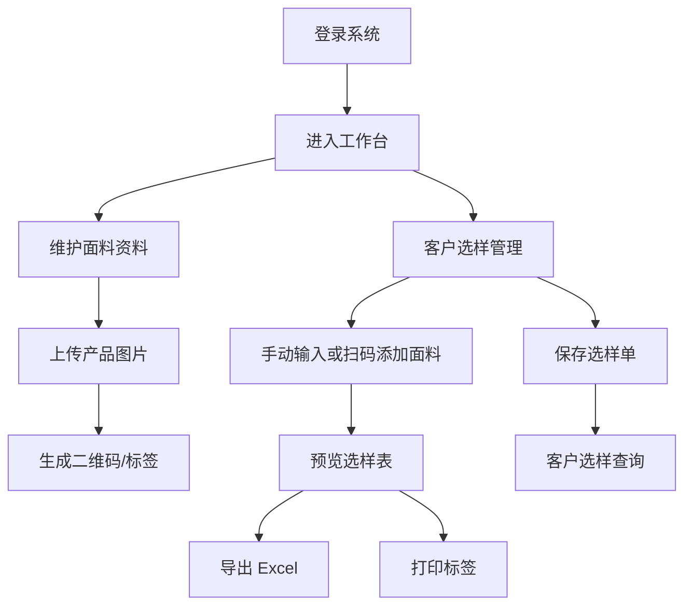

## 1. 产品概述

敏群商贸 ERP 是面向纺织面料样品贸易的 Web 管理系统，解决面料资料录入、客户选样、样品查询、Excel 导出、标签打印和权限管理问题。
- 目标用户为管理员和业务员工，首期以替代原 HSTIP 桌面软件中与样品业务相关的核心流程为目标。
- 产品价值在于提升面料样品管理效率，降低重复录入、查样、打印和导出成本。

## 2. 核心功能

### 2.1 用户角色

| 角色 | 登录方式 | 核心权限 |
|------|----------|----------|
| 管理员 | 系统账号登录 | 全部模块权限：面料、客户、供应商、样品、库存、用户、字典、日志 |
| 员工 | 系统账号登录 | 日常业务权限：面料维护、客户选样、选样查询、面料查询、标签打印、库存查询；不可查看供应商维护和客户资料维护 |

### 2.2 功能模块

1. **登录页**：账号密码登录、角色识别、会话保持。
2. **工作台**：快捷入口、近期选样、统计概览、常用操作。
3. **面料类别维护**：类别树、新增、编辑、停用、查询。
4. **面料资料维护**：面料主数据、规格、图片、成本权限、二维码、标签入口。
5. **供应商维护**：供应商资料管理，仅管理员可见。
6. **客户资料维护**：客户资料管理，仅管理员可见。
7. **客户选样管理**：手动编码、扫码枪、查询选择、批量选样、预览、导出、标签打印。
8. **客户选样查询**：历史选样单查询、详情、重新导出、重新打印。
9. **面料查询**：单个面料查询、详情、图片预览、单个标签打印。
10. **样品库存**：库位、入库、出库、库存查询（首期建议简版）。
11. **系统管理**：用户、角色、数据字典、操作日志。

### 2.3 页面详情

| 页面名称 | 模块名称 | 功能描述 |
|-----------|-------------|-------------|
| 登录页 | 认证 | 用户名密码登录，登录后进入对应权限菜单 |
| 工作台 | 首页 | 展示常用功能、最近选样、库存概览、快捷按钮 |
| 面料类别维护 | 前期管理 | 类别树维护，支持新增、编辑、停用和关键字查询 |
| 面料资料维护 | 前期管理 | 维护 Item No.、成分、组织、幅宽、克重、图片、成本、供应商、库位等信息 |
| 供应商维护 | 前期管理 | 管理供应商编码、名称、联系人、电话、地区、状态 |
| 客户资料维护 | 前期管理 | 管理客户编码、名称、联系人、地区、类型、状态 |
| 客户选样管理 | 样品管理 | 选择客户，通过手动编码、扫码枪或查询添加面料，生成选样单 |
| 客户选样查询 | 样品管理 | 查询历史选样单，查看明细，重新导出或打印 |
| 样品库位维护 | 样品库存 | 维护库位编码、名称、区域、状态 |
| 样品入库 | 样品库存 | 记录样品入库，增加库存 |
| 样品出库 | 样品库存 | 记录样品出库，减少库存并校验可用库存 |
| 样品库存查询 | 样品库存 | 查询当前库存、库位、入库流水、出库流水 |
| 面料查询 | 信息中心 | 查询单个或多个面料，查看详情，进入标签打印 |
| 标签打印页 | 打印 | 支持 70mm×40mm 标签预览、临时备注、二维码、单个/批量打印 |
| 数据字典 | 系统管理 | 维护单位、地区、客户类型、入库类型、出库类型等 |
| 用户管理 | 系统管理 | 用户新增、停用、重置密码、角色分配 |
| 操作日志 | 系统管理 | 查询新增、修改、删除、打印、导出等日志 |

## 3. 核心流程

### 3.1 面料建档流程

管理员或员工进入面料资料维护，新增面料，录入 Item No.、成分、组织、幅宽、克重、图片等资料，保存后可生成二维码并打印标签。

### 3.2 客户选样流程

用户选择客户，通过手动输入编码、扫码枪扫描二维码或查询选择面料加入选样清单，勾选规格、成本、图片显示项后预览，导出 Excel 或打印标签，最后保存选样记录。

### 3.3 标签打印流程

用户从面料查询或客户选样进入标签打印页，选择打印条目，输入临时备注，预览 70mm×40mm 标签，确认后打印到 Argox 标签打印机。

## 4. 用户界面设计

### 4.1 设计风格

- 主色：深海蓝 `#123C5A`，体现商贸 ERP 的稳定性。
- 辅色：织物米白 `#F5EFE4`、铜金色 `#C9944A`，呼应纺织面料和标签打印场景。
- 强调色：青绿色 `#1E8A7A`，用于确认、保存和主要操作。
- 布局：桌面优先，左侧菜单 + 顶部工具栏 + 内容卡片区。
- 字体：中文使用清晰现代无衬线字体，标题加粗，表格高密度但保留足够行距。
- 视觉特征：参考传统桌面 ERP 的高信息密度，同时用卡片、分区、固定操作栏提升易用性。

### 4.2 页面设计概览

| 页面名称 | 模块名称 | UI 元素 |
|-----------|-------------|-------------|
| 登录页 | 认证 | 左侧品牌说明，右侧登录卡片，深色渐变背景 |
| 工作台 | 首页 | 统计卡片、快捷入口、最近选样、待处理区 |
| 列表类页面 | 通用 | 查询表单、工具栏、数据表格、分页、批量操作 |
| 表单类页面 | 通用 | 分组表单、必填标识、只读状态、图片上传区 |
| 客户选样管理 | 样品管理 | 客户区、扫码输入区、选样明细表、导出配置抽屉 |
| 标签打印页 | 打印 | 标签画布预览、打印设置、临时备注、批量分页 |

### 4.3 响应式

- 桌面优先，适配 1366px 及以上宽度。
- 平板可使用折叠菜单和横向滚动表格。
- 手机端保留查询、查看和扫码添加能力，复杂表格操作以桌面为主。
