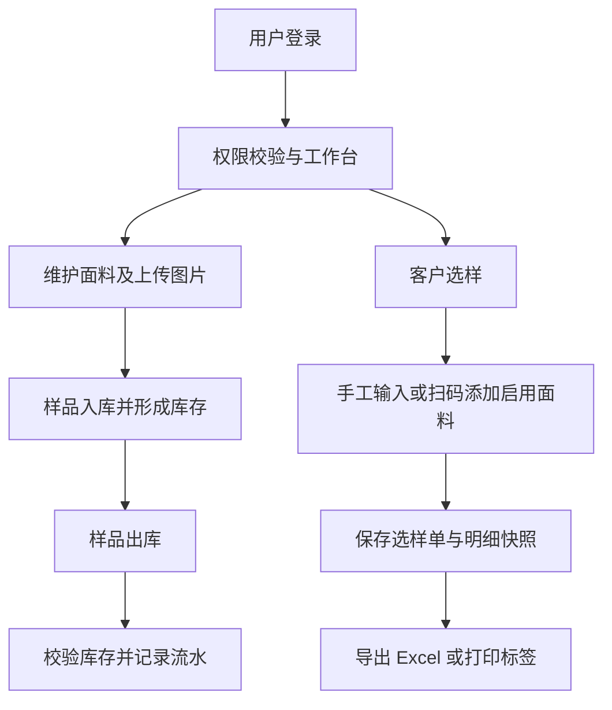

# 面料 ERP 产品需求文档（正式实施版）

## 1. 产品概述

面料 ERP 是面向纺织面料样品贸易场景的正式 Web 管理系统，替代原 HSTIP 桌面软件中本期确认的面料资料、客户选样、样品库存、查询、导出、标签打印及权限管理流程。

首期交付为可部署的全栈系统，而非本地演示原型。系统须使用真实账号、真实数据库与真实文件存储；在中国内地、台湾、香港稳定访问。

## 2. 实施范围

### 2.1 本期必须实现

1. **认证与权限**：账号密码登录、JWT 会话、多端同时登录、管理员与员工权限控制、账号启停和密码重置。
2. **面料类别维护**：类别树、新增、编辑、停用、查询；已引用类别不得物理删除。
3. **面料资料维护**：Item No. 唯一校验、规格、成本、供应商、库位、启停、图片上传与预览、标签打印入口。
4. **供应商维护**：管理员专属的供应商新增、编辑、停用、查询。
5. **客户资料维护**：管理员专属的客户新增、编辑、停用、查询；选样单保存客户名称快照。
6. **客户选样管理**：选择客户，手工输入或扫码枪录入 Item No.，重复扫码合并数量，临时备注，保存选样单。
7. **客户选样查询**：按单号、客户、面料、操作人、日期查询；查看详情、重新导出、重新打印；管理员可作废及恢复。
8. **样品库存**：库位维护、入库、出库、库存查询与流水查询；出库不可超过可用库存。
9. **面料查询**：按编码、名称、类别、规格、颜色、库存等查询；查看图片与详情；进入选样或打印。
10. **表格导出**：客户选样、面料查询、库存等导出 Excel；选样导出可选择规格、成本、图片字段。空规格显示 `/`。
11. **标签打印与扫码**：70mm×40mm 标签预览；Argox CP-2140M/3140 浏览器打印适配；二维码存储 Item No.；临时备注可覆盖或追加且不回写面料资料。
12. **系统管理**：用户、角色权限、数据字典、操作日志。日志记录登录、资料变更、库存变动、导出、打印和权限变更。

### 2.2 角色与数据权限

| 能力 | 管理员 | 员工 |
|---|---|---|
| 面料类别、面料资料、查询、选样、标签打印 | 可操作 | 可操作 |
| 供应商维护、客户资料维护 | 可操作 | 不可见且接口拒绝 |
| 成本、供应商字段 | 可见 | 默认隐藏 |
| 样品入库、出库、库存查询 | 可操作 | 可操作 |
| 用户、角色、字典、操作日志 | 可操作 | 不可见且接口拒绝 |
| 选样单作废/恢复 | 可操作 | 不可操作 |

### 2.3 不在本期范围

- 销售管理、采购管理、财务管理、电子审批。
- 完整合同、进出口、应收应付、发票、财务报表。
- 图片相似检索、手机扫码详情、自定义标签与导出模板作为后续增强项。

## 3. 页面与核心规则

| 页面 | 核心能力 | 关键规则 |
|---|---|---|
| 登录 | 账号密码登录、退出、会话续期 | 同账号多端不互踢；停用账号不能登录 |
| 面料资料维护 | 新增、编辑、启停、图片、多条件查询 | Item No. 全局唯一；停用面料不能新增选样和打印 |
| 客户选样管理 | 输入/扫码添加、明细、保存、导出、打印 | 扫码枪使用键盘输入与 Enter 结束；重复 Item No. 合并数量 |
| 客户选样查询 | 查询、详情、导出、打印、作废 | 保存时固化客户与面料明细快照；作废单不得打印 |
| 样品入库/出库 | 选择面料、数量、库位、备注 | 数量必须大于零；出库不得超库存；流水不可物理删除 |
| 标签打印 | 单个/批量预览、份数、临时备注 | 尺寸 70mm×40mm；二维码内容为 Item No. |
| 基础资料与系统管理 | 维护、启停、查询、审计 | 所有敏感菜单和接口均按角色限制 |

## 4. 核心业务流程

## 5. 非功能要求

- **跨地区可用性**：生产环境通过 HTTPS 对中国内地、台湾、香港提供稳定访问；上线前完成三地登录、查询、保存、图片预览、扫码、导出和打印联调。
- **性能**：列表接口分页；图片列表使用缩略图；导出大文件采用异步任务或明确等待反馈；连续扫码不得丢失录入。
- **安全**：密码使用强哈希存储；JWT 认证；接口执行角色和字段级权限校验；上传文件校验格式及大小；关键操作审计。
- **数据可靠性**：库存变动、选样保存等写操作使用数据库事务；作废替代物理删除；定期备份 PostgreSQL 与图片文件。
- **兼容性**：Chrome、Edge；USB 扫码枪键盘模式；Argox CP-2140M/3140 标签打印机。

## 6. 验收标准

1. 管理员与员工使用真实账号登录，员工无法通过前端或接口读取供应商、客户维护及敏感字段。
2. 面料新增、编辑、图片上传、启停在数据库中持久化；刷新后数据不丢失。
3. 扫码 Item No. 能加入选样单；重复扫码累计数量；停用或不存在 Item No. 有明确提示。
4. 选样单保存后可在查询页检索、查看实际明细、导出 Excel、重新打印；管理员可作废。
5. 入库增加库存、出库减少库存，超库存出库被拒绝；可查询库存与流水。
6. Excel 导出字段配置生效，图片列尺寸统一，空规格显示 `/`。
7. 标签按 70mm×40mm 预览和打印，二维码可由扫码枪识别为 Item No.，临时备注不回写主数据。
8. 内地、台北、香港测试网络均可完成本期主流程。
