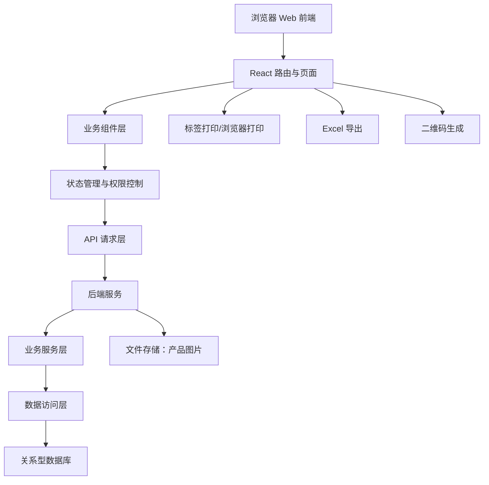
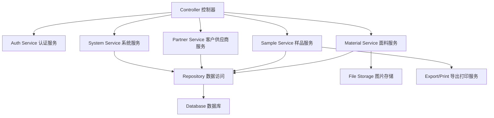
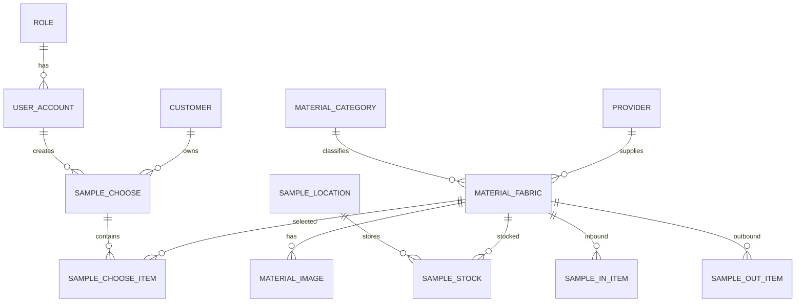

## 1. 架构设计



首期可先实现前端原型 + 本地模拟数据，快速验证页面、流程、权限、导出和打印样式；后续接入真实后端 API 与数据库。

## 2. 技术说明

* 前端：React\@18 + TypeScript + Vite

* 样式：Tailwind CSS\@3 + CSS Modules/全局变量

* 路由：React Router

* 状态管理：Zustand 或 React Context（首期轻量即可）

* 表格：自定义表格或 TanStack Table（如需要复杂列配置）

* 表单：React Hook Form（建议）

* Excel 导出：xlsx 或 exceljs（图片导出建议 exceljs）

* 二维码：qrcode

* 打印：浏览器打印 CSS，后续可评估 Argox 指令/本地打印服务

* 后端建议：Node.js/NestJS 或 Java Spring Boot（二选一，若仅先做前端 Demo 可暂不创建后端）

* 数据库建议：PostgreSQL 或 MySQL

* 文件存储：本地目录或对象存储，保存产品图片

## 3. 路由定义

| 路由                        | 用途     |
| ------------------------- | ------ |
| `/login`                  | 登录页    |
| `/`                       | 工作台首页  |
| `/dashboard`              | 工作台首页  |
| `/materials/categories`   | 面料类别维护 |
| `/materials/fabrics`      | 面料资料维护 |
| `/partners/providers`     | 供应商维护  |
| `/partners/customers`     | 客户资料维护 |
| `/samples/choose`         | 客户选样管理 |
| `/samples/choose-records` | 客户选样查询 |
| `/samples/locations`      | 样品库位维护 |
| `/samples/inbound`        | 样品入库   |
| `/samples/outbound`       | 样品出库   |
| `/samples/stock`          | 样品库存查询 |
| `/info/material-query`    | 面料查询   |
| `/print/labels`           | 标签打印页  |
| `/system/users`           | 用户管理   |
| `/system/roles`           | 角色权限   |
| `/system/dictionaries`    | 数据字典   |
| `/system/logs`            | 操作日志   |

## 4. API 定义

### 4.1 通用响应

```typescript
interface ApiResponse<T> {
  code: number;
  message: string;
  data: T;
}

interface PageResult<T> {
  list: T[];
  total: number;
  page: number;
  pageSize: number;
}
```

### 4.2 用户与权限

```typescript
type RoleCode = 'admin' | 'staff';

interface UserAccount {
  id: string;
  username: string;
  displayName: string;
  role: RoleCode;
  enabled: boolean;
  lastLoginAt?: string;
}

interface LoginRequest {
  username: string;
  password: string;
}

interface LoginResponse {
  token: string;
  user: UserAccount;
  permissions: string[];
}
```

### 4.3 面料资料

```typescript
interface MaterialFabric {
  id: string;
  itemNo: string;
  name: string;
  categoryId: string;
  composition?: string;
  construction?: string;
  width?: string;
  weight?: string;
  color?: string;
  unit?: string;
  costPrice?: number;
  salePrice?: number;
  providerId?: string;
  locationId?: string;
  stockQty?: number;
  remark?: string;
  labelRemark?: string;
  imageUrls: string[];
  enabled: boolean;
  createdAt: string;
  updatedAt: string;
}
```

### 4.4 客户选样

```typescript
interface SampleChoose {
  id: string;
  orderNo: string;
  customerId: string;
  customerNameSnapshot: string;
  chooseDate: string;
  operatorId: string;
  items: SampleChooseItem[];
  createdAt: string;
}

interface SampleChooseItem {
  id: string;
  materialId: string;
  itemNo: string;
  name: string;
  composition?: string;
  construction?: string;
  width?: string;
  weight?: string;
  imageUrl?: string;
  quantity: number;
  temporaryRemark?: string;
}
```

## 5. 服务端架构图



## 6. 数据模型

### 6.1 数据模型定义



### 6.2 关键表建议

* user\_account：用户账号

* role：角色

* material\_category：面料类别

* material\_fabric：面料资料

* material\_image：面料图片

* provider：供应商

* customer：客户

* sample\_choose：客户选样单

* sample\_choose\_item：客户选样明细

* sample\_location：样品库位

* sample\_in / sample\_in\_item：样品入库

* sample\_out / sample\_out\_item：样品出库

* sample\_stock：库存汇总

* operation\_log：操作日志

* data\_dictionary：数据字典

## 7. 首期开发策略

1. 先搭建 React 前端项目和页面骨架。
2. 使用 Mock 数据跑通登录、菜单、权限和核心页面。
3. 优先实现面料资料、客户选样、Excel 导出、标签打印。
4. 再补供应商、客户、库存、系统管理。
5. 最后接后端 API 与数据库。

