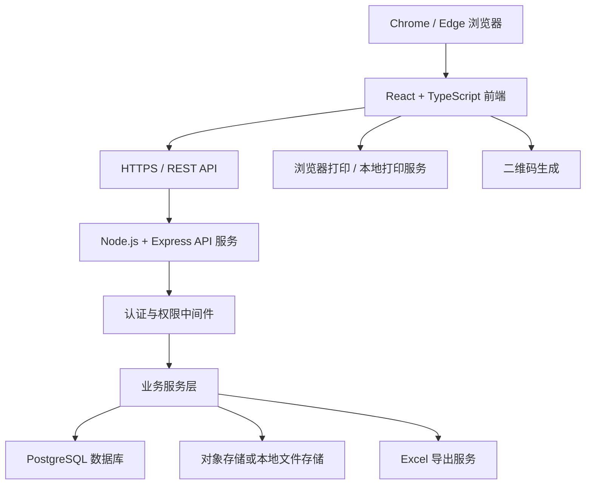
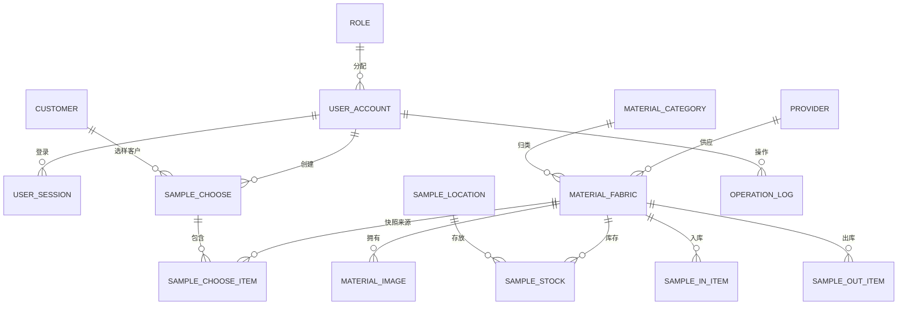

# 面料 ERP 技术架构（正式实施版）

## 1. 架构目标

采用 React 前端、Node.js TypeScript 后端和 PostgreSQL 数据库，提供可部署的正式 ERP 系统。现有 Mock/Zustand 数据仅作为界面开发过渡，正式实施时必须由 REST API 与 PostgreSQL 替换。



## 2. 技术栈

| 层级 | 选型 | 用途 |
|---|---|---|
| 前端 | React 18、TypeScript、Vite、React Router、Zustand、Tailwind CSS | Web 管理后台、路由、会话状态与 UI |
| 后端 | Node.js 20 LTS、Express 4、TypeScript | REST API、鉴权、业务服务、导出与上传 |
| 数据访问 | Prisma ORM | 数据模型、迁移、事务、类型安全查询 |
| 数据库 | PostgreSQL 16 | 事务数据、权限、库存、日志 |
| 身份认证 | bcrypt + JWT（访问令牌与刷新令牌） | 密码哈希、会话与多端登录 |
| 文件存储 | S3 兼容对象存储，开发环境可使用本地目录 | 面料原图、缩略图 |
| 导出 | ExcelJS | Excel 导出和图片嵌入 |
| 二维码 | qrcode | 生成以 Item No. 为内容的二维码 |
| 部署 | Docker Compose + Nginx + HTTPS | 前后端、API、数据库部署与反向代理 |

## 3. 项目结构

```text
src/                    前端 React 应用
api/
  src/
    app.ts              Express 应用入口
    routes/             路由与控制器
    services/           业务规则与事务
    repositories/       Prisma 数据访问
    middleware/         认证、权限、错误处理、日志
    lib/                JWT、文件、导出、二维码工具
  prisma/
    schema.prisma       数据模型
    migrations/         数据库迁移
  uploads/              开发环境图片目录
shared/                 前后端共享 DTO、枚举与权限定义
infra/
  docker-compose.yml    正式部署编排
  nginx.conf            HTTPS 反向代理配置
```

## 4. 认证、授权与安全

- 登录接口校验账号启用状态及 bcrypt 密码哈希，签发短期访问令牌与刷新令牌。
- 支持同账号多端登录：刷新令牌按设备会话保存，不做单点互踢。
- 所有 API 均使用认证中间件；供应商、客户、用户、角色、字典、日志接口仅管理员可访问。
- 成本价、供应商等字段在后端 DTO 层按角色剔除，不能仅依赖前端隐藏。
- 上传仅接受 JPG、PNG、WEBP，限制大小，服务端生成缩略图；文件路径不得由客户端直接指定。
- 所有写操作记录 `operation_log`；库存、选样单、状态变更使用事务。

## 5. API 约定

### 5.1 通用响应与分页

```typescript
interface ApiResponse<T> {
  code: number
  message: string
  data: T
}

interface PageResult<T> {
  list: T[]
  total: number
  page: number
  pageSize: number
}
```

### 5.2 主要路由

| 方法 | 路径 | 说明 |
|---|---|---|
| POST | `/api/auth/login` | 登录 |
| POST | `/api/auth/refresh` | 刷新令牌 |
| POST | `/api/auth/logout` | 退出当前会话 |
| GET/POST/PATCH | `/api/materials`、`/api/materials/:id` | 面料查询、新增、编辑 |
| POST | `/api/materials/:id/images` | 上传面料图片 |
| POST | `/api/materials/:id/toggle` | 启用/停用面料 |
| GET/POST/PATCH | `/api/categories`、`/api/providers`、`/api/customers` | 基础资料维护 |
| GET/POST/PATCH | `/api/sample-chooses`、`/api/sample-chooses/:id` | 选样单保存、查询、作废 |
| GET/POST/PATCH | `/api/sample-locations` | 库位维护 |
| POST | `/api/sample-inbounds` | 样品入库，事务增加库存 |
| POST | `/api/sample-outbounds` | 样品出库，事务校验并减少库存 |
| GET | `/api/sample-stocks` | 库存及流水查询 |
| POST | `/api/exports/sample-chooses/:id` | 选样 Excel 导出 |
| POST | `/api/labels/preview` | 标签预览数据与二维码内容 |
| GET/POST/PATCH | `/api/system/users`、`/api/system/roles`、`/api/dictionaries` | 管理员系统管理 |
| GET | `/api/system/operation-logs` | 操作日志 |

## 6. 数据模型



### 6.1 核心表

- `role`、`user_account`、`user_session`
- `material_category`、`material_fabric`、`material_image`
- `provider`、`customer`、`sample_location`
- `sample_choose`、`sample_choose_item`
- `sample_in`、`sample_in_item`、`sample_out`、`sample_out_item`、`sample_stock`
- `data_dictionary`、`operation_log`、`print_log`、`export_log`

### 6.2 关键约束与索引

- `material_fabric.item_no`、`provider.code`、`customer.code`、`sample_location.code` 唯一。
- 选样单保留客户名称、面料编码、名称和规格快照，避免主数据变动影响历史记录。
- `sample_stock` 按面料与库位唯一；入库、出库修改库存和写入流水必须在同一事务中完成。
- 为面料编码、名称、类别、客户、选样日期、库存库位、操作日志时间建立索引。
- 所有业务表保留创建人、创建时间、修改人、修改时间；关键单据采用作废标记，不物理删除。

## 7. 部署与运维

- 使用 Docker Compose 部署 `web`、`api`、`postgres`、`nginx` 服务；生产数据库和对象存储使用托管服务或独立持久卷。
- Nginx 提供 HTTPS、静态前端、API 反向代理、上传大小限制和安全响应头。
- 图片采用跨地区可访问的对象存储与 CDN；应用服务器选择能覆盖内地、台湾、香港的区域与网络线路。
- 环境变量包括数据库连接、JWT 密钥、对象存储密钥、允许域名、上传限制与标签公司名称；不得提交到仓库。
- 每日备份 PostgreSQL；定期校验图片备份；保存应用错误日志与操作日志。
- 上线前在内地、台北、香港分别验证登录、查询、保存、图片、扫码、Excel 导出、标签打印。

## 8. 实施顺序

1. 初始化 `api`、Prisma、PostgreSQL 迁移、环境变量与 Docker Compose。
2. 实现认证、角色权限、中间件与操作日志。
3. 实现类别、供应商、客户、面料、图片上传 API，并将前端由 Mock 改为 API。
4. 实现客户选样、二维码扫码、Excel 导出、标签预览与打印日志。
5. 实现库位、入库、出库、库存汇总和事务校验。
6. 实现用户、字典、日志管理，完成自动化测试、三地联调和部署验收。
