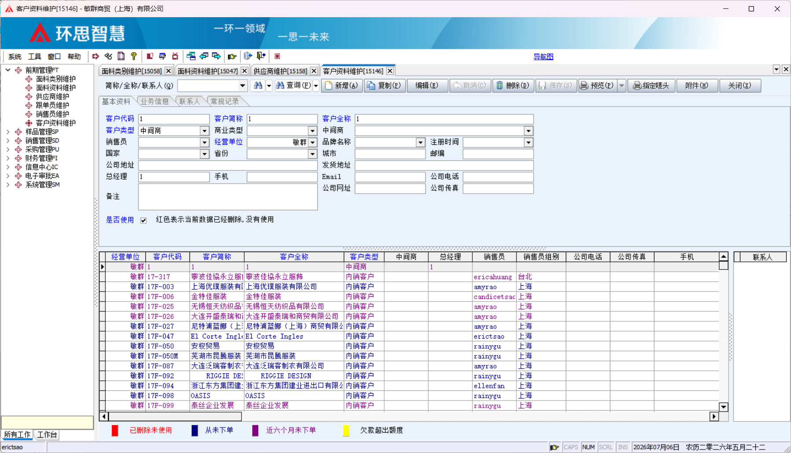

# 面料 ERP （已确认）

# 任务总纲：

1、主进销存，辅管理的一个erp系统

2、以下提到的页面内容和功能需要全部保留

4、账号管理需有两种管理模式，其中一种为管理员账户，另一种为员工账户，账户之间不会互相顶掉，且数据互通，员工账户版无法查看**供应商维护**和**客户资料维护**。

5、标签打印机：需要能够匹配
Argox立象 CP\-2140M 3140

铜版纸 70mm\*40mm
标签格式展示如下：

6、标签打印时，多一个临时增加备注的选项

7、8月中旬前出demo，至少9月27日前测试完成可以正常使用

# 疑问：

1、标签上的二维码扫码枪可以扫吗？

可以

2、表格增加显示图片时的预览选项是否如下？图片显示在表格中的什么位置？什么样的大小？

规格全，带成本，带图

规格全，带成本，不带图

规格全，不带成本，不带图

规格不全，带成本，带图

规格不全，不带成本，带图

规格不全，不带成本，不带图

有没有办法改成就一栏 然后自选 规格✔ 成本✔ 图片✔ 这种方式？

改为多选的方式，选择到了就显示，未选择就不显示

表格后面多加一列显示图片的位置是否可以实现？

3、客户选样查询的功能是什么来着

在客户选样管理新增客户选的样过后，会在系统里留下该客户选样的记录，然后再查询功能里可以去查找

4、扫码的功能是在什么位置用的（展示或者截图）

基本都在客户选样管理里用

5、是否还有其他补充。

昨天忘了一个步骤，在面料资料维护的环节，除了面料基础信息外还会加上产品图片。

\*我想到一个我之前一直都想要的功能，你看看会不会太有难度，就是多一个可以找类似样的功能，输入一张图片然后就根据输入的图片在系统里找类似外观or产品信息的类似产品。

## 1\.前期管理（须保留）

这一块基本上是按照原字段原功能保留，主要功能为录入产品信息

### 面料类别维护

要求：此部分的内容需要全部保留，无新增功能

### 面料资料维护

要求：此部分的内容需要全部保留，且无新增功能

### 供应商维护

要求：此部分的内容需要全部保留，仅管理员账号可见

### 客户资料维护

要求：此部分的内容需要全部保留，仅管理员账号可见。

## 2\.样品管理

### 客户选择管理（批量处理）

要求：此部分的内容需要全部保留，此页面可以多选产品，选完后会将多条数据展示在将导出的表格中（如以下图三），相对应还有智能选择单条进行管理。

**1\.手动输入编码添加产品到此表格**
**2\.直接扫描二维码添加产品到此表格**
**3\.预览表格时添加一个选项：是否带样图**
暂定格式可能如下：
规格全，带成本，带图
规格全，带成本，不带图
规格全，不带成本，不带图
规格不全，带成本，带图
规格不全，不带成本，带图
规格不全，不带成本，不带图
**4\.表格格式优化**
**5\.标签打印时，多一个临时增加备注的选项**

**手动添加：**

#### **批量产品表格预览**

**表格范例如下：**

表格内容按照库内录入进行信息展示，有规格按规格显示无规格显示“/”。

表格可导出，导出后的表格单元格排版布局需做优化调整，**优化要求：尽量不要有乱七八糟的小小格子。**

#### **批量标签**

选好标签内容后点击预览则出现标签页

#### **扫二维码添加产品步骤：需补充具体操作步骤**

## 3\.信息中心

### 面料查询（单个处理）

要求：此部分的内容需要全部保留。

在这里点击预览也可直接进入标签打印页面

目前用的是Argox立象 CP\-2140M 3140

铜版纸 70mm\*40mm

## 4\.系统管理

两种管理模式，其中一种为管理员账户，另一种为员工账户，账户之间不会互相顶掉，且数据互通，员工账户版无法查看**供应商维护**和**客户资料维护**。

## 5\.不用做内容：

销售管理

采购管理

财务管理

电子审批

